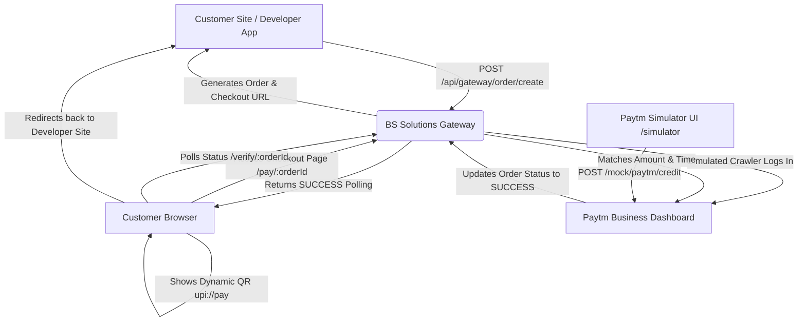

# Walkthrough: BS Solutions UPI Gateway

BS Solutions is a fully functional, self-hosted UPI Gateway that mimics the core features of upigateway.com. It allows merchants to generate API keys, create dynamic payment QR codes on client websites, and verify payment credits on a simulated Paytm Business Dashboard using credentials.

---

## System Architecture



---

## File Directory Map

The application is built inside a Next.js framework using Vanilla CSS:

- **Configuration:**
  - [package.json](file:///c:/Users/BHARATHKUMAR/OneDrive/Full%20Stack%20Projects/UPI%20GATEWAY/package.json) - App details, scripts (`dev`, `build`), and package list (`next`, `react`, `react-dom`, `qrcode`, `lucide-react`).
  - [jsconfig.json](file:///c:/Users/BHARATHKUMAR/OneDrive/Full%20Stack%20Projects/UPI%20GATEWAY/jsconfig.json) - Directs module import mapping (`@/*` to `./src/*`).
  - [next.config.js](file:///c:/Users/BHARATHKUMAR/OneDrive/Full%20Stack%20Projects/UPI%20GATEWAY/next.config.js) - Next.js compiler preferences.

- **Backend & Database Services:**
  - [db.js](file:///c:/Users/BHARATHKUMAR/OneDrive/Full%20Stack%20Projects/UPI%20GATEWAY/src/lib/db.js) - High-speed file-system JSON database reader/writer supporting users, orders, and mock transaction tables.
  - [paytmVerifier.js](file:///c:/Users/BHARATHKUMAR/OneDrive/Full%20Stack%20Projects/UPI%20GATEWAY/src/lib/paytmVerifier.js) - Verification engine checking mock transaction history, claiming credits, and logging authentication messages to simulate web scraping.

- **API Routes (`src/app/api`):**
  - `/auth/register` - Registers new merchant profiles.
  - `/auth/login` - Authenticates user login credentials.
  - `/auth/profile` - Manages Paytm details, and handles API Key generation/revocation.
  - `/gateway/order/create` - Developer endpoint to initiate orders.
  - `/gateway/order/status/[orderId]` - Internal status checker for checking payment success.
  - `/gateway/order/verify/[orderId]` - Runs the Paytm crawler verifier against mock settlements.
  - `/merchant/transactions` - Returns all orders associated with a merchant ID.
  - `/mock/paytm/transactions` & `/mock/paytm/credit` - Handles reading and writing entries to the mock Paytm settlement ledger.

- **Views & UI Pages (`src/app`):**
  - [globals.css](file:///c:/Users/BHARATHKUMAR/OneDrive/Full%20Stack%20Projects/UPI%20GATEWAY/src/app/globals.css) - Vanilla CSS stylesheet containing custom theme variables, typography, layouts, badges, and terminal loader animations.
  - `layout.js` - Global page head configuration.
  - `page.js` - Portal landing page explaining the gateway architecture.
  - `login/page.js` - Login and registration toggles.
  - `dashboard/page.js` - Portal admin panel featuring Settings form, interactive Sandbox generator, and transaction history tables.
  - `pay/[orderId]/page.js` - Gateway checkout screen containing dynamic base64 QR code generators, timers, deep links, and live crawl terminal console logs.
  - `simulator/page.js` - Mock Paytm Business portal for simulating wallet credits.

---

## Local Verification & Build Results

The code compiled successfully into optimized static and dynamic bundle routes:
```text
✓ Compiled successfully in 10.1s
   Linting and checking validity of types ...
   Collecting page data ...
   Generating static pages (0/14) ...
 ✓ Generating static pages (14/14)
   Finalizing page optimization ...
   Collecting build traces ...

Route (app)                                 Size  First Load JS
┌ ○ /                                    1.44 kB         107 kB
├ ƒ /api/auth/login                        144 B         103 kB
├ ƒ /api/auth/profile                      144 B         103 kB
├ ƒ /api/auth/register                     144 B         103 kB
├ ƒ /api/gateway/order/create              144 B         103 kB
├ ƒ /api/gateway/order/status/[orderId]    144 B         103 kB
├ ƒ /api/gateway/order/verify/[orderId]    144 B         103 kB
├ ƒ /api/merchant/transactions             144 B         103 kB
├ ƒ /api/mock/paytm/credit                 144 B         103 kB
├ ƒ /api/mock/paytm/transactions           144 B         103 kB
├ ○ /dashboard                           3.65 kB         109 kB
├ ○ /login                                1.4 kB         107 kB
├ ƒ /pay/[orderId]                       13.9 kB         116 kB
└ ○ /simulator                           2.41 kB         108 kB
```

---

## How to Test Locally (Step-by-Step)

Follow these instructions to experience the full dynamic checkout and crawling check flow:

### 1. Launch the Server
Run the local dev command in the workspace directory:
```bash
npm run dev
```
Open `http://localhost:3000` in your web browser.

### 2. Register & Configure Merchant Account
- Click **Merchant Login** on the home page navbar.
- Click **Sign Up** at the bottom, enter details (e.g. Email: `dev@example.com`, Business: `My Shop`), and click **Sign Up**.
- In the dashboard, configure:
  - **Paytm Merchant ID**: `216900012345`
  - **Paytm Merchant UPI ID**: `myshop@paytm`
  - **Staff Role Phone Number**: `9876543210`
  - **Staff Role Password**: `securepass`
- Click **Save Configuration**.
- Click **Generate API Key** under the right-hand panel and copy the secret key.

### 3. Generate a Payment Order (Developer Sandbox)
- Navigate to the **Developer Sandbox** tab in the dashboard.
- Enter an amount (e.g. `150.00`).
- Click **Generate Payment QR Link**.
- Copy the generated Checkout URL (e.g., `http://localhost:3000/pay/bs_xxxx`) or click the button next to it to open it.

### 4. Scan & Pay (Payment Gateway Checkout)
- On the checkout screen, note the dynamic QR code containing the UPI deep link (`upi://pay?pa=myshop@paytm&am=150.00...`), the 5-minute checkout countdown, and the active crawler log terminal.
- The terminal will display live polling:
  ```text
  [PaytmCrawler] Initiating verification for Order ID: bs_xxxx (Amount: ₹150)
  [PaytmCrawler] Using Paytm Merchant ID: 216900012345
  [PaytmCrawler] Connecting to Paytm Business login portal (using Role Mobile: ******3210)...
  [PaytmCrawler] Submitting credentials & initiating secure session...
  [PaytmCrawler] Navigating to 'Payments Received & Settlements' dashboard...
  [PaytmCrawler] Scanning completed. No unclaimed transaction of ₹150 was found...
  ```

### 5. Simulate Wallet Credit (Paytm Simulator)
- Keep the checkout tab open. In another tab or from the merchant dashboard navbar, open **Paytm Simulator** (`http://localhost:3000/simulator`).
- The Merchant MID `216900012345` is automatically pre-loaded.
- Set **Credit Amount** to `150.00` (must match your sandbox checkout order exactly).
- Input a customer sender name (e.g., `Amit Patel`).
- Click **Send Simulated Payment Credit**.
- You will see the incoming transaction display under the **Paytm Settlement Log** on the right side as `UNCLAIMED CREDIT`.

### 6. Verify Auto-Settlement
- Return to your checkout tab. Within 5 seconds, watch the logs update in the terminal:
  ```text
  [PaytmCrawler] MATCH FOUND! Detected Credit of ₹150 with Paytm Txn ID: PTMxxxxx
  [PaytmCrawler] Order bs_xxxx marked as PAID successfully.
  ```
- The checkout page will immediately display a green **Payment Successful!** screen.
- Go back to the **Simulator** tab. You will see that the transaction has updated to `CLAIMED BY CRAWLER`.
- Refresh the Merchant Dashboard's **Transaction History** tab to view your completed order, logged with its Paytm reference transaction ID.
